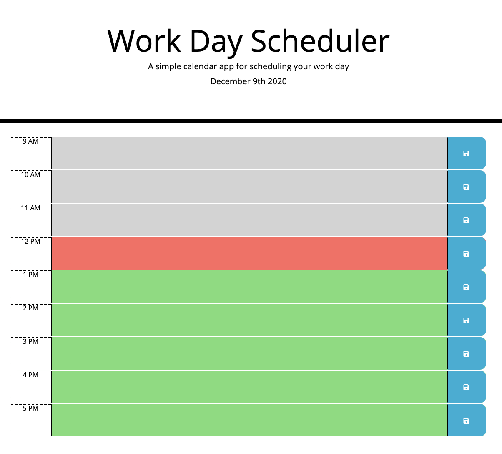

# Day Planner

## Description

This is a single day planner that has standard business hours for use. Once you open the application, you see the current day displayed at the top along with hour blocks below for you to type in. Each hour block is color coded in real time (grey is in the past, red in present, and green in the future). You are able to type a task in the hour block and save it in the local storge of the browser so that you can return later to see it again. 

### Usage

To use this app you need only type the task you want to do in the hour block in which you want to do it and click the save icon. This will keep the task in the local storage of the browser and allow you to navigate away from the page and back again while keeping your task on the list. 

### Screenshots
#### Initial welcome when opening the website:

#### Items stored in local storage of the browser

### Links
Link to github reposity: https://github.com/gtscott90/day-planner
Link to deployed application: https://gtscott90.github.io/day-planner/

